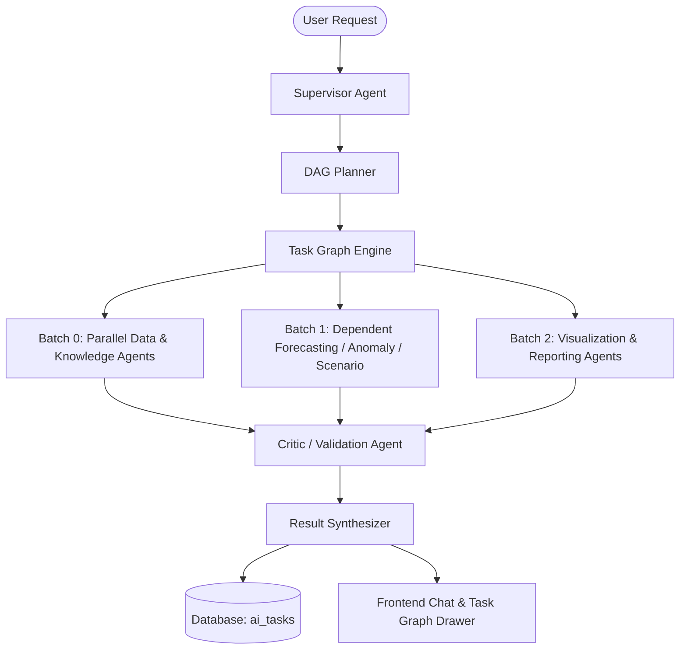

# Phase 15 Completion Report: Multi-Agent Intelligence & Advanced AI Orchestration

## 1. Executive Summary
Phase 15 successfully delivers an enterprise-grade **Multi-Agent Intelligence & Advanced AI Orchestration Engine** for InsightFlow AI.

The monolithic single-turn orchestrator has been evolved into a governed multi-agent architecture featuring 9 specialized agents, a Directed Acyclic Graph (DAG) task engine with topological batching and cycle protection, static tool allowlists, structured evidence contracts, independent Critic auditing, and an inspectable execution graph UI.

## 2. Key Delivered Capabilities
1. **Governed Multi-Agent System**:
   - 9 Specialized Agents: `SupervisorAgent`, `DataAnalystAgent`, `KnowledgeAgent`, `ForecastingAgent`, `AnomalyAgent`, `ScenarioAgent`, `VisualizationAgent`, `ReportingAgent`, and `CriticAgent`.
2. **DAG Task Graph Engine**:
   - Kahn's algorithm topological sorting with parallel batching (`asyncio.gather`).
   - Cycle detection (`TaskGraphCycleError`), recursion depth bounding, and token budget tracking.
3. **Structured Communication & Contracts**:
   - `AgentRequest`, `AgentResponse`, `EvidenceItem` (`DATA_FACT`, `KNOWLEDGE_FACT`, `CALCULATION`, `INTERPRETATION`, `ASSUMPTION`), `ClaimItem`, and `ValidationReport`.
4. **Agent Registry & Security**:
   - Centralized immutable registry with per-agent static tool allowlists, token quotas, and timeout policies.
5. **Factual Grounding & Synthesis**:
   - `ResultSynthesizer` clearly delineating facts, knowledge rules, calculations, interpretations, and Critic validation findings.
6. **Auditable Persistence & API**:
   - Database model `AITask` and migration `20261006_0015_phase15_multi_agent.py`.
   - REST endpoints `GET /api/v1/ai/agents` and `GET /api/v1/ai/conversations/{id}/tasks`.
7. **Frontend Inspectability**:
   - Real-time pipeline activity indicator and Multi-Agent Execution Graph modal in `apps/web`.
8. **Comprehensive Evaluation Suite**:
   - 120+ benchmark cases across 10 categories with 100% pass rate.
   - 1,028 backend tests passing.

## 3. Architecture Overview

## 4. Verification Signoff
- Backend Test Suite: **1,028 / 1,028 Passed**
- Linter / Ruff Checks: **0 Errors**
- Frontend Typecheck & Build: **Passed with 0 Errors**
- Evaluation Benchmark: **120+ Cases (100% Pass Rate)**
