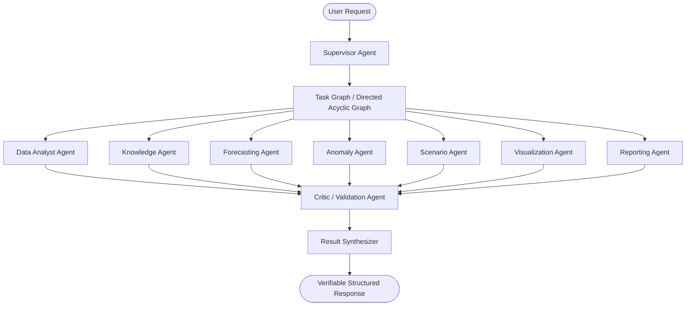

# Phase 15: Multi-Agent Intelligence & Advanced AI Orchestration

## 1. Overview
Phase 15 transforms InsightFlow AI from a monolithic single-turn orchestrator into a governed, specialized multi-agent analytical system. Rather than having a single general-purpose agent perform all analytical reasoning and execution, Phase 15 establishes 9 specialized agents coordinated by a **Supervisor Agent** and verified by a **Critic Agent**.

## 2. Multi-Agent Architecture

## 3. Specialized Agents
1. **Supervisor Agent**: Intent decomposition, dependency DAG planning, execution dispatching, and error recovery.
2. **Data Analyst Agent**: Deterministic DuckDB calculations, SQL aggregations, and Phase 10 multi-dataset federations.
3. **Knowledge Agent**: Phase 14 hybrid RAG, domain policy retrieval, terminology lookup, and citation extraction.
4. **Forecasting Agent**: Phase 11 statistical forecasting, model backtesting, and horizon trajectory calculation.
5. **Anomaly Agent**: Phase 12 anomaly detection, severity scoring, and dimensional root-cause breakdown.
6. **Scenario Agent**: Phase 13 what-if parameter modification and deterministic sensitivity simulation.
7. **Visualization Agent**: Phase 7 context-aware chart recommendation, schema generation, and accessibility validation.
8. **Reporting Agent**: Phase 9 structured executive summary compilation and narrative formatting.
9. **Critic / Validation Agent**: Independent factual auditing, numerical consistency verification, and citation grounding checks.

## 4. Key Guarantees
- **Static Tool Allowlist Enforcement**: Subagents are strictly restricted to their registered tool subsets.
- **Topological Parallel Batching**: Independent DAG tasks run concurrently with `asyncio.gather`.
- **Recursion & Token Budget Limits**: Task graphs are bounded by maximum depth and strict token quotas.
- **Evidence Contract Isolation**: Untrusted context is isolated into explicit structured evidence chunks.
