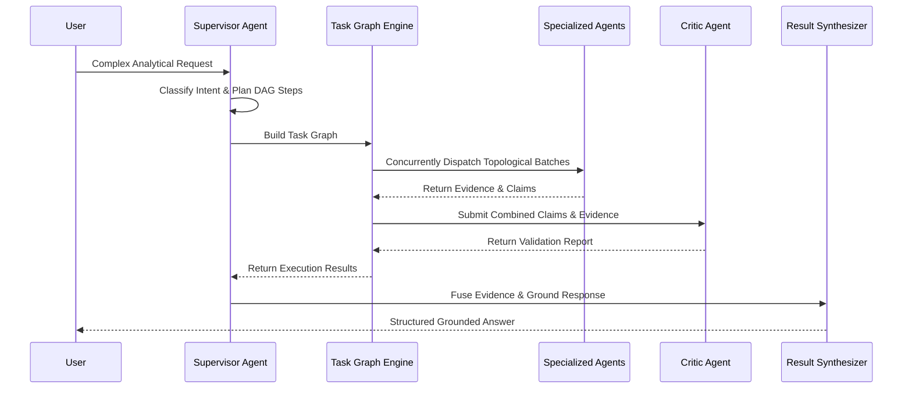

# Phase 15: Supervisor Agent & DAG Task Planner

## 1. Intent Decomposition & DAG Formation
The `SupervisorAgent` serves as the central orchestrator responsible for analyzing natural-language user queries and decomposing complex analytical tasks into a dependency Directed Acyclic Graph (DAG).

## 2. Planning Heuristics
- **Parallel Dispatch**: Independent tasks (e.g. Data Analyst + Knowledge Agent) are assigned dependency-free nodes for concurrent execution in batch 0.
- **Sequential Dependencies**: Downstream tasks (e.g. Visualization Agent or Reporting Agent) declare dependencies on data tasks and only execute after upstream results complete.
- **Critic Audit Gate**: A final `critic_agent` validation task is automatically scheduled to audit all generated claims against collected evidence before final synthesis.

## 3. Dynamic Intent Triggering
- **Data Computation**: Queries with metrics or groupings trigger `DataAnalystAgent`.
- **Domain Policies / Rules**: Queries referencing standards, SLA definitions, or terms trigger `KnowledgeAgent`.
- **Hybrid Queries**: Multi-step queries evaluate real metrics against policy rules simultaneously.
- **Forecasting / Anomalies / Scenarios**: Forward projections, outliers, and what-if questions trigger their dedicated mathematical engines.
