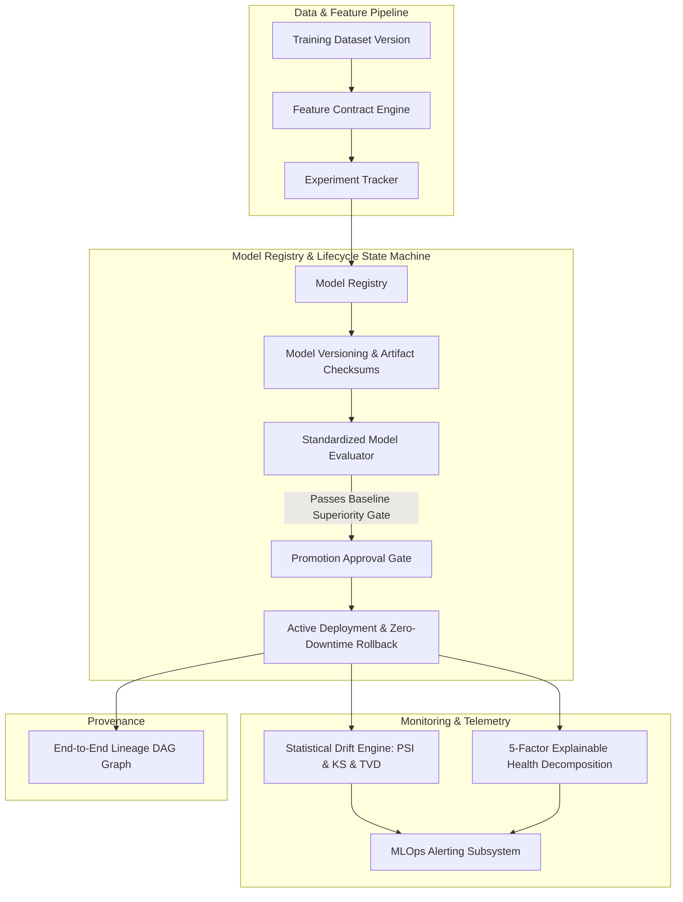

# Phase 16 — Production MLOps, Model Lifecycle & AI Model Monitoring Architecture

## 1. Executive Overview
Phase 16 establishes a standardized, multi-model production MLOps platform for InsightFlow AI. It manages the complete lifecycle of statistical and machine learning models across 8 distinct task families:
- **Forecasting** (SARIMA, Exponential Smoothing, Naive, Seasonal Naive)
- **Anomaly Detection** (Isolation Forest, Z-score, IQR)
- **Classification** (Random Forest, Logistic Regression, Gradient Boosting)
- **Regression** (Ridge, ElasticNet, Ordinary Least Squares)
- **Clustering** (K-Means, DBSCAN)
- **Recommendation** (Matrix Factorization, Collaborative Filtering)
- **Embedding** (Domain Terminology, FastEmbed)
- **LLM Adapters** (Fine-tuned prompts, adapter weights)

---

## 2. Core Architectural Components

---

## 3. Key Design Principles
1. **Immutable Artifacts & SHA-256 Checksums**: Every model version artifact is hashed upon registration. Mismatched checksums prevent execution.
2. **Explicit Baseline Comparison Gate**: Models must demonstrate superior performance over task-specific baselines (e.g. 20%+ MAE improvement over Seasonal Naive for forecasting) before promotion to `VALIDATED` or `PRODUCTION`.
3. **Controlled State Machine**: Lifecycle transitions follow explicit pathways (`DRAFT` &rarr; `VALIDATING` &rarr; `VALIDATED` &rarr; `STAGED` &rarr; `PRODUCTION`). Direct unvalidated promotions are rejected.
4. **No Autonomous Deployment / Retraining**: The system alerts and recommends retraining with full explainability; human sign-off is required for all production mutations.
5. **Strict Tenant & Workspace Isolation**: Model artifacts, versions, metrics, and deployments are strictly isolated per user and workspace.
