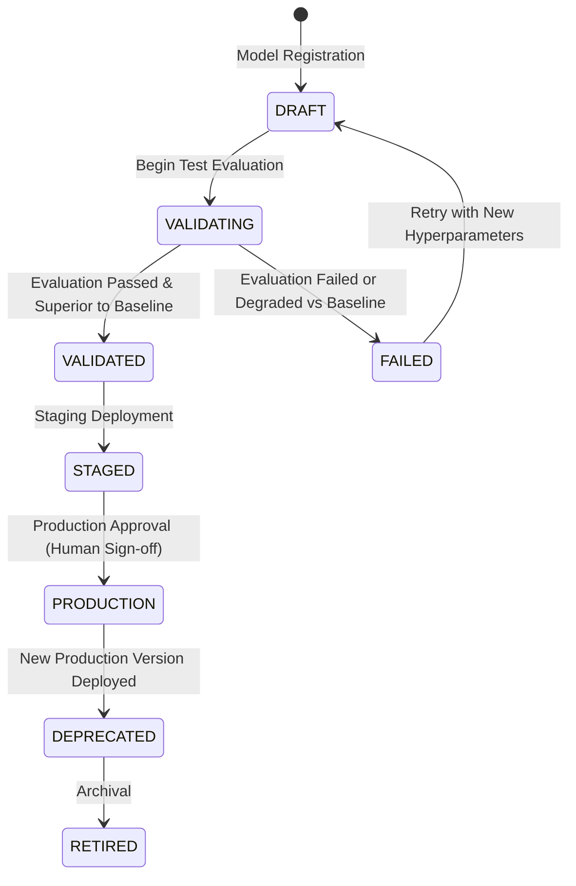

# Phase 16 — Controlled Model Lifecycle State Machine & Rollback

## 1. Lifecycle State Machine
Model versions advance through strict, deterministic states:

## 2. Transition Rules & Gating
- **`DRAFT` &rarr; `PRODUCTION` (Blocked)**: Direct deployment without validation is prohibited with `HTTP 400 InvalidModelTransitionError`.
- **`VALIDATED` &rarr; `PRODUCTION` (Permitted)**: Requires explicit baseline superiority verification and audit approval logging (`approved_by`, `reason`, `approved_at`).
- **Production Exclusivity**: When version $V_{new}$ enters `PRODUCTION`, any prior active production version $V_{old}$ is automatically transitioned to `DEPRECATED`.

## 3. Instant Zero-Downtime Rollback
- Admins and operators can invoke `/api/v1/mlops/versions/{id}/rollback`.
- The target prior validated version is reactivated in `PRODUCTION` and a critical `MODEL_ROLLBACK` alert is recorded for full telemetry traceability.
