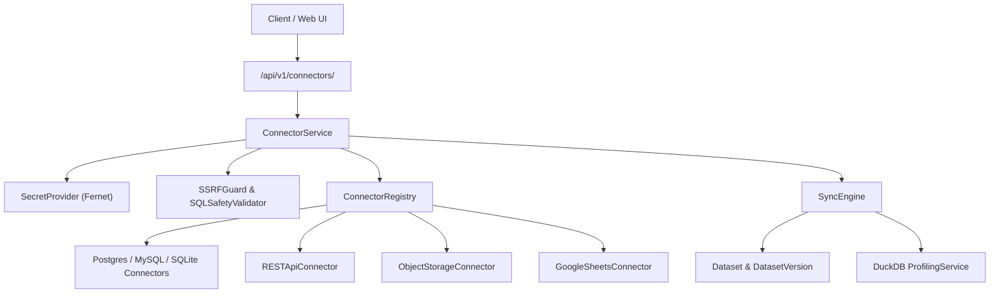

# Phase 17 — Enterprise Data Connector Architecture

## Executive Overview
Phase 17 expands InsightFlow AI from file-centric uploads into an enterprise data integration hub. The architecture supports provider-independent data source connectors across:
1. **Relational Databases:** PostgreSQL, MySQL, SQLite
2. **REST APIs & Webhooks:** Generic HTTP endpoints with pagination and JSON flattening
3. **Cloud Object Storage:** AWS S3, Google Cloud Storage, Azure Blob Storage (Parquet, CSV, JSON)
4. **Cloud Spreadsheets:** Google Sheets & Excel Worksheets

## Core Abstractions

### 1. `DataConnector` Base Class
Located in `apps/api/app/connectors/base.py`:
- `connect()`: Establishes client session or connection pool.
- `validate_connection()`: Performs a read-only handshake, measures latency in milliseconds, and counts available resources.
- `discover_schema()`: Introspects metadata without downloading datasets.
- `preview(resource_id, limit)`: Samples up to 500 rows safely with parameter binding.
- `ingest(resource_id, sync_type, ...)`: Extracts records into in-memory chunks for dataset ingestion.

### 2. `ConnectorRegistry`
Located in `apps/api/app/connectors/registry.py`:
- Maintains centralized registration mapping `ConnectorType` to concrete classes.
- Provides dynamic catalog metadata (`/api/v1/connectors/catalog`) detailing supported authentication methods, required configuration keys, and capabilities.
