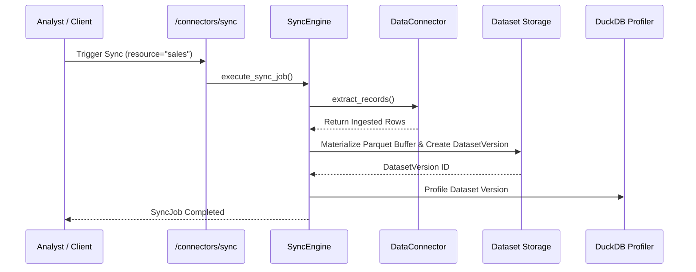

# Phase 17 — Ingestion & Synchronization Engine

## Synchronization Architecture (`SyncEngine`)
Located in `apps/api/app/connectors/sync_engine.py`.

The `SyncEngine` bridges external data connections with InsightFlow AI's core analytical storage:
1. **Extraction:** Chunks records from the remote source according to the selected mode (`FULL_SYNC` or `INCREMENTAL_SYNC`).
2. **Buffer Materialization:** Converts records into optimized Parquet/CSV file buffers in temporary storage.
3. **Dataset Versioning:** Calls `create_dataset_with_file` or `create_dataset_version` to create an immutable `DatasetVersion` linked to the user account.
4. **DuckDB Profiling:** Automatically triggers `ProfilingService.profile_version()` to compute statistical summaries, missingness metrics, column correlations, and semantic concepts.
5. **Audit Logging:** Emits structured records into `data_connection_audit_logs` tracking bytes transferred, elapsed time, and row counts.

